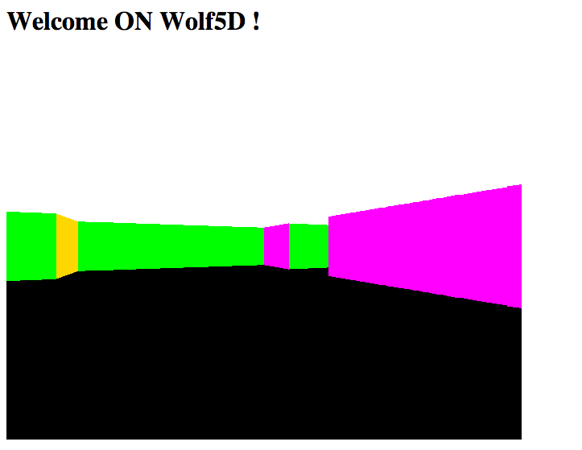

wolfHTML5
=========

I just get bored one day and decided to redo this little app (which is initially a project I had to do in my first year at EPITECH french engineering school in C) using HTML5 and plain Javascript.

This is a one afternoon project, don't look for awesome code architecture here :-).
Given a map stored in a plain 2d array, it will paint a world using a basic raycasting method.

